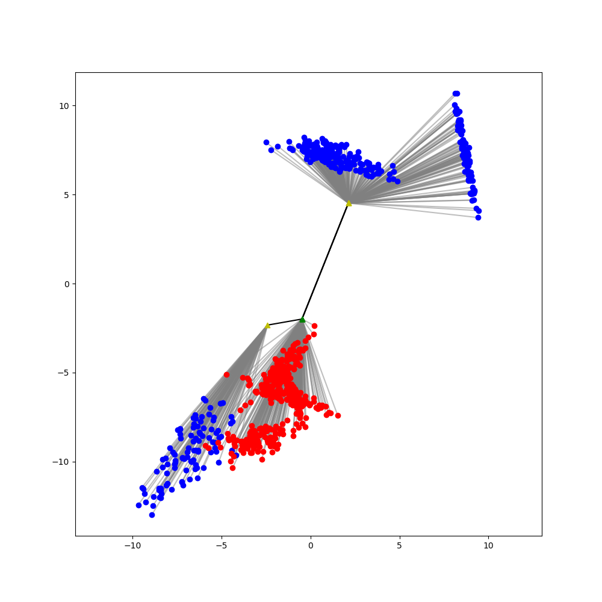

# Latent Optimal Transport

An unofficial pytorch implementation of *Making transport more robust and interpretable by moving data through a small number of anchor points*.

## Synthetic Data Experiment

